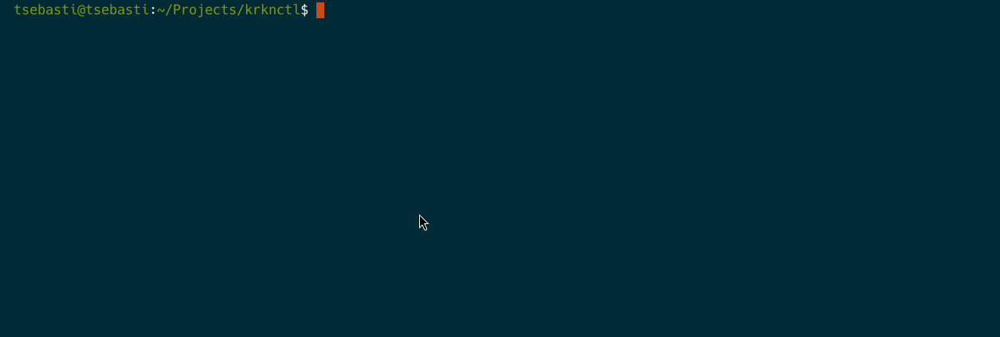
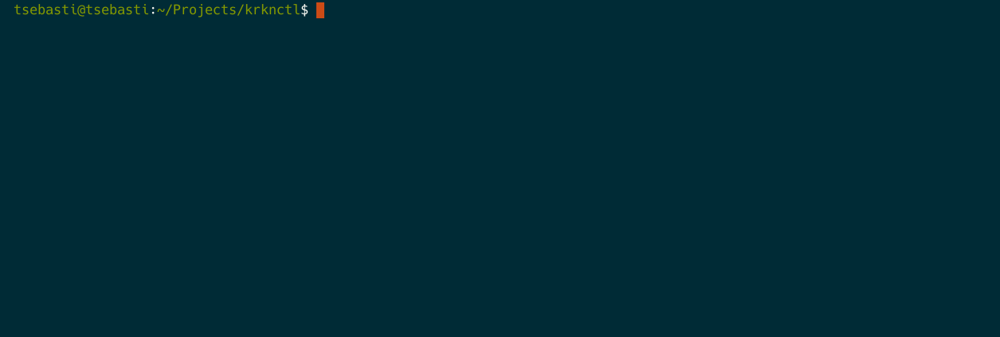
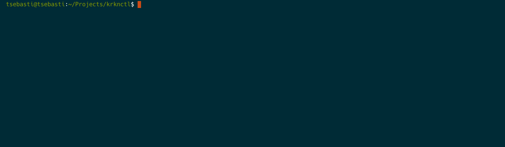
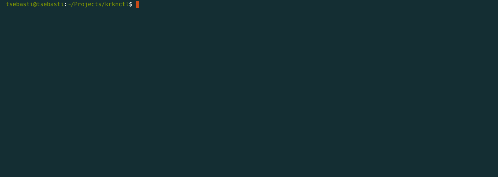
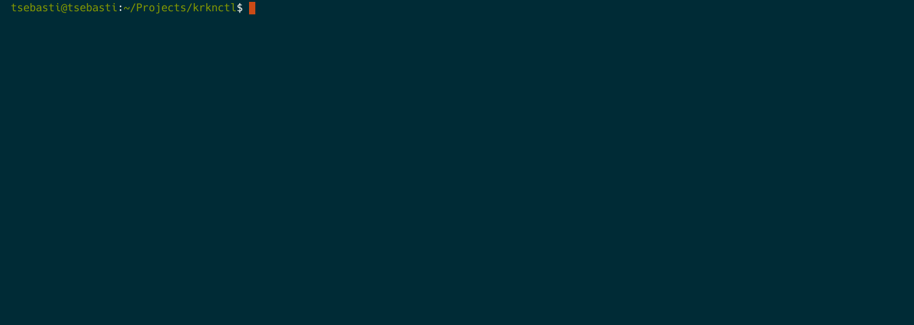

# krknctl
Krkn Terminal UI & CLI

## Dev Blog
As this project is actively evolving, consider this README as more of a _Development Blog_ to showcase current features under development.

## Scenario Metadata
### Online Mode
In online mode, `krknctl` leverages the `quay.io` API to retrieve scenario metadata. This metadata describes scenarios, enables autocomplete for available scenarios, and validates input. Nothing is stored locally, and no custom APIs are used; everything is based on OCI standards. The image metadata is labeled and accessed through the Quay.io image inspection API.

### Offline Mode
_Work In Progress_

## Command Autocompletion

### Mac autocompletion

autoload -Uz compinit
compinit

Command autocompletion is powered by the [Cobra Command](https://github.com/spf13/cobra) Library. Metadata is retrieved as described above, and the autocompletion feature is installed via the `completion` command. It is compatible with most popular *nix shells:



### `describe` Scenario

Displays details of a scenario and its specific flags:


### `list` Available Scenarios

Shows all scenarios available in the registry:


### `run` Scenario

Executes a scenario image with the necessary flags (translated as the respective container environment variables), validating the inputs against the type schema defined within the image manifest.

#### Type Schema
The type schema is a simple typing system designed to validate user input. Here is an example of the schema format:

```json
[
    {
        "name":"cpu-percentage",
        "shortDescription":"CPU percentage",
        "description":"Percentage of total CPU to be consumed",
        "variable":"TOTAL_CHAOS_DURATION",
        "type":"number",
        "required":"true"
    },
    {
        "name":"namespace", 
        "shortDescription":"Namespace",
        "description":"Namespace where the scenario container_manager will be deployed",
        "variable":"NAMESPACE",
        "type":"string",
        "default":"default"
    }
]
```

Supported types include:
- `number`
- `bool`
- `string`
- `enum`
- `base64`
- `file`

Key features for each type:
- **All types**:
    - Support for default values and required fields
    - Upcoming features: dependency on another field (`requires`) and mutual exclusion (`mutuallyExcludes`)
- **String**:
    - Regex validation
- **Enum**:
    - Specific allowed values

Each schema element corresponds to a command flag in the format `--<field_name>`



input is validated against this schema:



## Container Runtime Integration

### Podman

>![NOTE] To compile the project `dnf install btrfs-progs-devel`
> to enable podman user socket systemctl start --user podman.socket
> to use podman cli with the socket `export CONTAINER_HOST=unix://run/podman/podman.sock`

Containers are running, working on the wiring, stay tuned!

_Work In Progress_

### Docker
_Work In Progress_


### Build on mac 
brew install gpgme


### Cross compiling
export GOOS="darwin/linux"
export GOARCH="amd64/arm64"

go build -tags containers_image_openpgp -gcflags=all="-l -B -wb=false" -ldflags="-w -s" -o bin-linux-amd64/ ./...

go build -tags containers_image_openpgp -ldflags="-w -s" -o bin-darwin-arm/ ./...