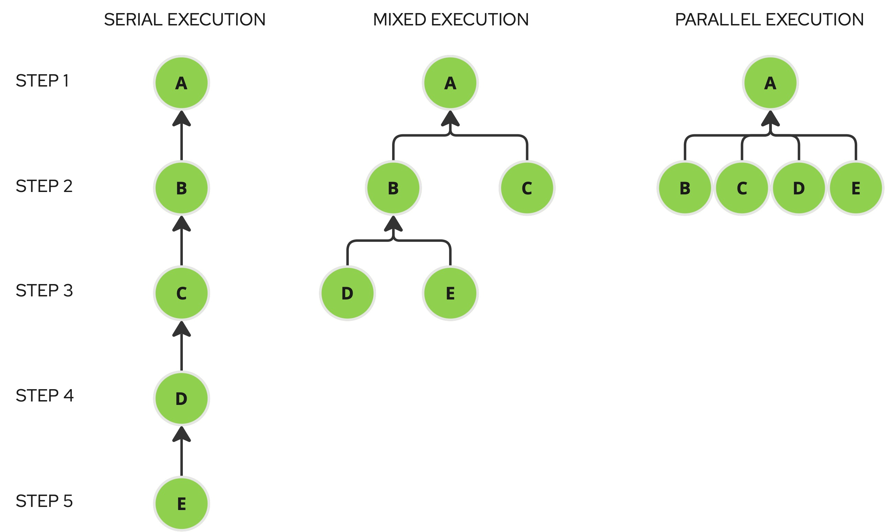

# krknctl
## [krkn](https://github.com/krkn-chaos/krkn) chaos engineering tool CLI

<br/>
<br/>

> [!CAUTION]  
> __The tool is currently in alpha stage, use it at your own risk.__

<br/>

## Overview:
`Krknctl` is a tool designed to run and orchestrate [krkn](https://github.com/krkn-chaos/krkn) chaos scenarios utilizing 
container images from the [krkn-hub](https://github.com/krkn-chaos/krkn-hub). 
Its primary objective is to streamline the usage of `krkn` by providing features like:

- Command auto-completion
- Input validation
- Scenario descriptions and detailed instructions

and much more, effectively abstracting the complexities of the container environment. 
This allows users to focus solely on implementing chaos engineering practices without worrying about runtime complexities.

<br/>

## Autocompletion:
The first step to have the best experience with the tool is to install the autocompletion in the shell so that the tool
will be able to suggest to the user the available command and the description simply hitting `tab` twice.

### Bash (linux):
```
source <(./krknctl completion bash)
```
> [!TIP] 
> To install autocompletion permanently add this command to `.bashrc` (setting the krknctl binary path correctly)
### zsh (MacOS):
```
autoload -Uz compinit
compinit
source <(./krknctl completion zsh)
```
> [!TIP] 
> To install autocompletion permanently add this command to `.zshrc` (setting the krknctl binary path correctly)

<br/>

## Requirements:
### Running:
#### Linux:
##### Dictionaries:
To generate the random words we use the american dictionary, it is often available but if that's not the case:
- **Fedora/RHEL**: `sudo dnf install words`
- **Ubuntu/Debian**: `sudo apt-get install wamerican`

### Building from sources:
#### Linux:
To build the only system package required is libbtrfs:

- **Fedora/RHEL**: `sudo dnf install btrfs-progs-devel`
- **Ubuntu/Debian**: `sudo apt-get install libbtrfs-dev`
#### MacOS:
- **gpgme**: `brew install gpgme` 

#### Build commands: 
`go build -tags containers_image_openpgp -ldflags="-w -s" -o bin/ ./...`

>[!NOTE]
> To build for different operating systems/architectures refer to `GOOS` `GOARCH` [golang variables](https://pkg.go.dev/internal/platform)

<br/>

## Container Runtime:
The tool supports both Podman and Docker to run the krkn-hub scenario containers. The tool interacts with the container
runtime through Unix socket. If both container runtimes are installed in the system the tool will default on `Podman`.

### Podman:
Steps required to enable the Podman support
#### Linux:
- enable and activate the podman API daemon
```
sudo systemctl enable --now podman
```
- activate the user socket
```
systemctl enable --user --now podman.socket 
```

#### MacOS:
If both Podman and Docker are installed be sure that the docker compatibility is disabled

### Docker:
#### Linux:
Check that the user has been added to the `docker` group and can correctly connect to the Docker unix socket  
running the comman `podman ps` if an error is returned  run the command `sudo usermod -aG docker $USER`

<br/>

## Commands:
Commands are grouped by action and may include one or more subcommands to further define the specific action.

### `list <subcommand>`:

- #### `available`:
Builds a list of all the available scenarios in krkn-hub

- #### `running`:
Builds a list of all the scenarios currently running in the system. The scenarios are filtered based on the tool's naming conventions.

<br/>

### `describe <scenario name>`:
Describes the specified scenario giving to the user an overview of what are the actions that the scenario will perform on
the target system. It will also show all the available flags that the scenario will accept as input to modify the behaviour 
of the scenario.

<br/>

### `run <scenario name> [flags]`:
Will run the selected scenarios with the specified options

> [!NOTE]
> Because the kubeconfig file may reference external certificates stored on the filesystem, 
> which won't be accessible once mounted inside the container, it will be automatically 
> copied to the directory where the tool is executed. During this process, the kubeconfig
> will be flattened by encoding the certificates in base64 and inlining them directly into the file.

> [!TIP]
> if you want interrupt the scenario while running in attached mode simply hit `CTRL+C` the
> container will be killed and the scenario interrupted immediately

__Common flags:__

| Flag              | Description                                                  |
|-------------------|--------------------------------------------------------------|
| --kubeconfig      | kubeconfig path (if empty will default to ~/.kube/config)    |
| --detached        | will run the scenario in detached mode (background) will <br/>be possible to reattach the tool to the container logs with the attach command |
| --alerts-profile  | will mount in the container a custom alert profile <br/>(check krkn [documentation](https://github.com/krkn-chaos/krkn) for further infos) |
| --metrics-profile | will mount in the container scenario a custom metrics<br/> profile (check krkn [documentation](https://github.com/krkn-chaos/krkn) for further infos) |

<br/>

### `graph <subcommand>`:
In addition to running individual scenarios, the tool can also orchestrate 
multiple scenarios in serial, parallel, or mixed execution by utilizing a 
scenario dependency graph resolution algorithm.

- #### `scaffold <scenario names>`:

Scaffolds a basic execution plan structure in json format for all the scenario names provided.
The default structure is a serial execution with a root node and each node depends on the 
other starting from the root. Starting from this configuration it is possible to define complex 
scenarios changing the dependencies between the nodes.
Will be provided a random id for each scenario and the dependency will be defined through the 
`depends_on` attribute. The scenario id is not strictly dependent on the scenario type so it's 
perfectly legit to repeat the same scenario type (with the same or different attributes) varying the
scenario Id and the dependencies accordingly.
```
./krknctl graph scaffold node-cpu-hog node-memory-hog node-io-hog service-hijacking node-cpu-hog > plan.json
```
will generate an execution plan (serial) containing all the available options for each of the scenarios mentioned with default values
when defined, or a description of the content expected for the field.

> [!NOTE]
> Any graph configuration is supported except cycles (self dependencies or transitive)

- #### `run <json execution plan path> [flags]`:

It will display the resolved dependency graph, detailing all the scenarios executed at each dependency step, and will instruct 
the container runtime to execute the krkn scenarios accordingly.
> [!NOTE]
> Since multiple scenarios can be executed within a single running plan, the output is redirected 
> to files in the directory where the command is run. These files are named using the following 
> format: krknctl-<scenario-name>-<scenario-id>-<timestamp>.log.


#### Supported flags:

| Flag              | Description                                                  |
|-------------------|--------------------------------------------------------------|
| --kubeconfig      | kubeconfig path (if empty will default to ~/.kube/config)    |
| --alerts-profile  | will mount in the container a custom alert profile <br/>(check krkn [documentation](https://github.com/krkn-chaos/krkn) for further infos)|
| --metrics-profile | will mount in the container scenario a custom metrics <br/>profile (check krkn [documentation](https://github.com/krkn-chaos/krkn) for further infos)|


#### Supported graph configurations:

##### Serial execution:
All the nodes depend on each other building a chain, the execution will start from the last item of the chain.

##### Mixed execution:
The graph is structured in different "layers" so the execution will happen step-by-step executing all the scenarios of the
step in parallel and waiting the end

##### Parallel execution:
To achieve full parallel execution, where each step can run concurrently (if it involves multiple scenarios), 
the approach is to use a root scenario as the entry point, with several other scenarios dependent on it. 
While we could have implemented a completely new command to handle this, doing so would have introduced additional
code to support what is essentially a specific case of graph execution.

Instead, we developed a scenario called `dummy-scenario`. This scenario performs no actual actions but simply pauses 
for a set duration. It serves as an ideal root node, allowing all dependent nodes to execute in parallel without adding 
unnecessary complexity to the codebase.


### `attach <scenario ID>`:
If a scenario has been executed in detached mode or through a graph plan and you want to attach to the container
standard output this command comes into help.

> [!TIP]
> to interrupt the output hit `CTRL+C`, this won't interrupt the container, but only the output 

> [!TIP]
> if shell completion is enabled, pressing TAB twice will display a list of running 
> containers along with their respective IDs, helping you select the correct one.
 
<br/>

### `clean`:
will remove all the krkn containers from the container runtime, will delete all the kubeconfig files
and logfiles created by the tool in the current folder.